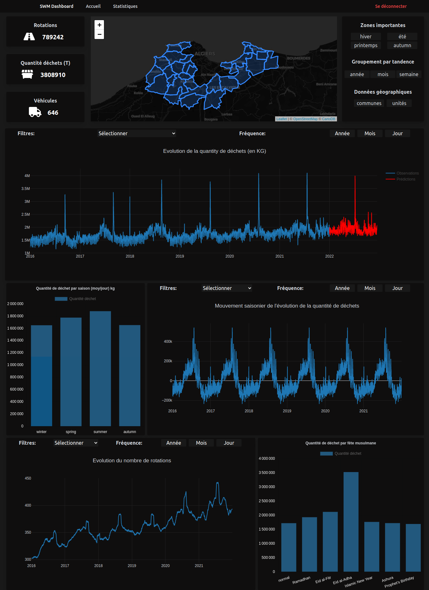
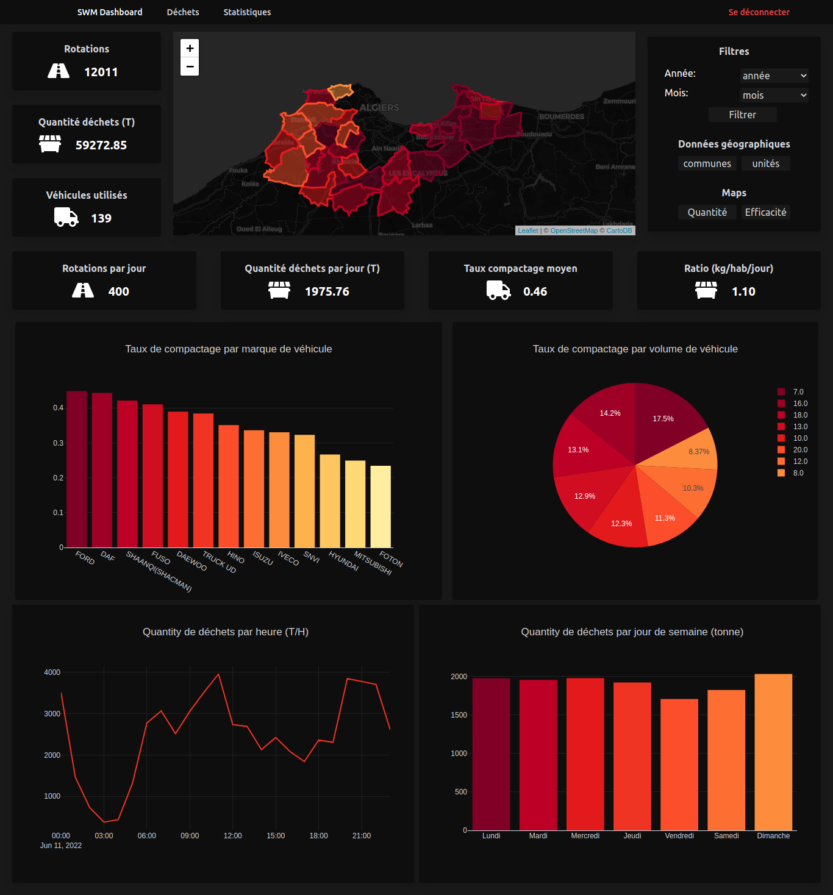

## Business intelligence dashboard for solid waste management.

This is an interactive geographic dashboard for data visualization in different aspects (geographic, graphical and tabular) and allows statistical analysis for the purpose of drawing conclusions and making decisions.

The data used in this project is related to the operation of collection and transportation of solid waste in algiers, Algeria. 
This app is connected to an api that we created to analyse data and make prediction with machine learning, for more information about this api [click here](https://github.com/raouftams/SWM_ML_API).

This dashboard contains two main interfaces, the first one opens on a complete visualization of all the data and the other one allows the monthly follow-up of the evolution of the different parameters and indicators related to solid waste generation and management.

*Sorry for not making a demo, the data used in the project is confidential.*

